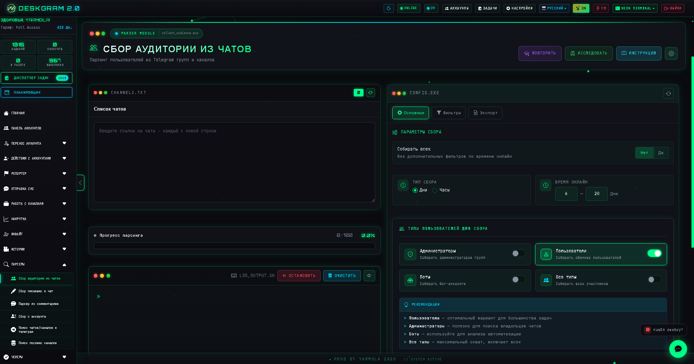
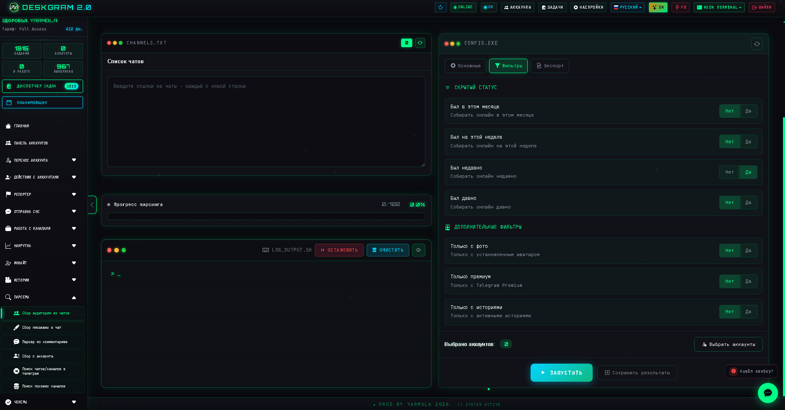
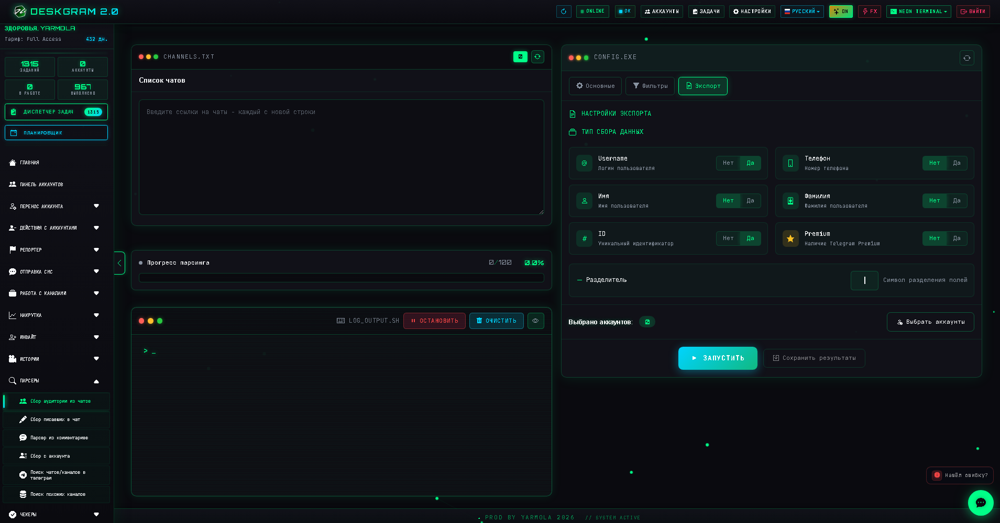

# Сбор аудитории из Telegram чатов через Deskgram 2

`Сбор аудитории` — это модуль Deskgram 2 для парсинга пользователей из Telegram-групп и чатов. Он помогает собирать базу под рассылки, инвайт и сегментацию, используя фильтры по активности, скрытому статусу, фото, Premium и другим признакам.

[Главный хаб Deskgram 2](https://github.com/Deskgram-2/deskgram-2-telegram-automation) · [Сайт](https://deskgram2.com/) · [Telegram-бот](https://t.me/DG2welcomebot) · [Web preview](https://deskgram2.com/web-preview)
## Интерактивный Web Preview

Попробовать модуль в браузере: [Открыть веб-превью](https://deskgram2.com/web-preview?path=%2Fapp-demo%2Ffunctions%2Fcollect_audience)

## Кратко о модуле

| Параметр | Что внутри |
|---|---|
| Основная задача | Парсинг пользователей из групп и чатов Telegram |
| Что можно фильтровать | Онлайн-статус, скрытый статус, фото, Premium, истории |
| Что получаете | Экспортируемую базу для следующих модулей |
| Полезен для | Подготовки базы под рассылки в ЛС и инвайт |
| Связанные модули | Рассылка в ЛС, Инвайт, Панель аккаунтов |

## Что умеет модуль

- собирать пользователей из Telegram-групп и чатов;
- работать с публичными и приватными источниками;
- фильтровать аудиторию по времени онлайна;
- использовать скрытый статус как дополнительный фильтр;
- отбирать только пользователей с фото, Premium или историями;
- исключать ботов;
- экспортировать результаты в файл.

## Быстрый старт

1. Укажите список чатов или групп для парсинга.
2. Настройте режим сбора и фильтры.
3. Задайте параметры производительности.
4. Выберите формат экспорта.
5. Назначьте аккаунты и запустите задачу.

## Куда идти после сбора

- [Рассылка в ЛС](https://github.com/Deskgram-2/telegram-direct-messaging-deskgram), если база нужна под личные сообщения.
- [Инвайт](https://github.com/Deskgram-2/telegram-invite-tool-deskgram), если база будет использоваться для роста групп и каналов.
- [Панель аккаунтов](https://github.com/Deskgram-2/telegram-account-manager-deskgram), если нужно распределить и подготовить аккаунты под дальнейшую работу.
- [Массовые подписки](https://github.com/Deskgram-2/telegram-join-groups-deskgram), если сначала нужно подготовить окружение для дальнейших сценариев.

## Как связать этот модуль с discovery и growth-цепочками

- [Поиск каналов и групп](https://github.com/Deskgram-2/telegram-channel-search-deskgram), если сначала нужно найти релевантные площадки;
- [Поиск похожих каналов](https://github.com/Deskgram-2/telegram-similar-channels-deskgram), если вы масштабируете discovery от seed-каналов;
- [Сбор аудитории из комментариев](https://github.com/Deskgram-2/telegram-comment-audience-parser-deskgram), если нужна более вовлеченная база;
- [Сбор писавших в чатах](https://github.com/Deskgram-2/telegram-active-chat-users-parser-deskgram), если вы собираете активных участников обсуждений;
- [Нейрорассылка](https://github.com/Deskgram-2/telegram-neuro-mailing-deskgram), если база дальше идет в AI-коммуникацию;
- [Диспетчер задач](https://github.com/Deskgram-2/telegram-task-manager-deskgram), если важно видеть весь путь от discovery до коммуникации в одном месте.

## Интерфейс модуля

### Главный экран

Здесь находятся список источников, индикатор прогресса и основной блок запуска задачи.

### Фильтры

Во вкладке фильтров можно сегментировать аудиторию по нужным признакам.

### Логи и прогресс

Во время работы видно подключение к чатам, ход парсинга и итоговый результат.

## Когда особенно полезен

- когда нужна база под личные рассылки;
- когда вы строите сценарий сбора базы с последующим инвайтом;
- когда нужно отбирать более качественную аудиторию, а не собирать всех подряд;
- когда важен экспорт данных для дальнейшей обработки.

## Почему это удобнее ручного сбора

| Ручной подход | Сбор аудитории через Deskgram 2 |
|---|---|
| Нужно вручную смотреть участников | Пользователи собираются автоматически |
| Сложно отделить активных от пассивных | Есть фильтры по онлайну и статусам |
| Плохо масштабируется на много чатов | Нагрузка распределяется по аккаунтам |
| Данные неудобно переносить дальше | База экспортируется в файл |
| Нет прозрачности процесса | Есть прогресс, логи и итоговый результат |

## Сценарии применения

### Сценарий 1. База под личные сообщения

Это один из самых частых сценариев: собрать пользователей по чатам, отфильтровать лишнее и передать базу в [рассылку в ЛС](https://github.com/Deskgram-2/telegram-direct-messaging-deskgram).

### Сценарий 2. Подготовка базы под инвайт

Если цель не диалог, а рост сообщества, модуль работает как подготовительный слой перед [инвайтом](https://github.com/Deskgram-2/telegram-invite-tool-deskgram). Такой путь особенно полезен, когда вы хотите сначала отсеять ботов и слабые сегменты.

### Сценарий 3. Discovery -> parser -> communication

Когда работа начинается не с готовых чатов, а с поиска площадок, сценарий обычно выглядит так: [поиск каналов и групп](https://github.com/Deskgram-2/telegram-channel-search-deskgram) -> [поиск похожих каналов](https://github.com/Deskgram-2/telegram-similar-channels-deskgram) -> сбор аудитории -> коммуникация.

## Что выбрать: поиск площадок или сбор аудитории

| Если задача такая | Лучше использовать |
|---|---|
| Нужно сначала найти сами Telegram-площадки в нише | [Поиск каналов и групп](https://github.com/Deskgram-2/telegram-channel-search-deskgram) |
| Нужно получить уже список пользователей из чатов | [Сбор аудитории](https://github.com/Deskgram-2/telegram-audience-parser-deskgram) |
| Нужна более вовлеченная база из обсуждений | [Сбор из комментариев](https://github.com/Deskgram-2/telegram-comment-audience-parser-deskgram) |
| Нужна база для DM или invite | Сбор аудитории как промежуточный слой перед следующими модулями |

## Что выбрать: сбор аудитории, сбор из комментариев или сбор писавших в чатах

| Если задача такая | Лучше использовать |
|---|---|
| Нужна широкая база участников из групп и чатов | [Сбор аудитории](https://github.com/Deskgram-2/telegram-audience-parser-deskgram) |
| Нужна более теплая база из обсуждений под постами | [Сбор из комментариев](https://github.com/Deskgram-2/telegram-comment-audience-parser-deskgram) |
| Нужны пользователи, которые уже проявляли активность в чатах | [Сбор писавших в чатах](https://github.com/Deskgram-2/telegram-active-chat-users-parser-deskgram) |
| Нужно построить несколько сегментов под разные воронки | Комбинировать все три подхода |

## FAQ для рабочих сценариев

### Когда лучше вести базу в рассылку, а когда в инвайт?

Если нужен личный контакт и предварительное касание, база логичнее идет в [рассылку в ЛС](https://github.com/Deskgram-2/telegram-direct-messaging-deskgram). Если цель в росте группы или канала по уже собранному списку, логичнее переходить в [инвайт](https://github.com/Deskgram-2/telegram-invite-tool-deskgram).

### Какой тип базы обычно дает более сильный отклик?

Чаще всего лучше работают более теплые сегменты: пользователи из активных обсуждений, комментариев и живых чатов. Но широкий массовый сбор тоже полезен, если дальше база будет дофильтровываться или использоваться в многоступенчатой воронке.

### Что делать, если сначала еще не ясно, какие площадки парсить?

Тогда путь лучше начинать с discovery-модулей: [поиска каналов и групп](https://github.com/Deskgram-2/telegram-channel-search-deskgram) и [поиска похожих каналов](https://github.com/Deskgram-2/telegram-similar-channels-deskgram). Уже после этого проще переходить к самому сбору аудитории.

## Смежные репозитории

- [Главный хаб Deskgram 2](https://github.com/Deskgram-2/deskgram-2-telegram-automation)
- [Рассылка в ЛС](https://github.com/Deskgram-2/telegram-direct-messaging-deskgram)
- [Инвайт](https://github.com/Deskgram-2/telegram-invite-tool-deskgram)
- [Панель аккаунтов](https://github.com/Deskgram-2/telegram-account-manager-deskgram)
- [Поиск каналов и групп](https://github.com/Deskgram-2/telegram-channel-search-deskgram)
- [Поиск похожих каналов](https://github.com/Deskgram-2/telegram-similar-channels-deskgram)
- [Нейрорассылка](https://github.com/Deskgram-2/telegram-neuro-mailing-deskgram)
- [Диспетчер задач](https://github.com/Deskgram-2/telegram-task-manager-deskgram)

## FAQ

### Можно ли собирать всех без фильтров?

Да. Для этого можно использовать режим массового сбора без дополнительной сегментации.

### Можно ли экспортировать результат?

Да. Модуль рассчитан на дальнейшее использование базы в других сценариях.

### Нужны ли несколько аккаунтов?

Не обязательно, но несколько аккаунтов помогают быстрее распределять нагрузку.

### Какой следующий шаг после парсинга?

Чаще всего эту базу используют дальше в рассылке в ЛС или в инвайте.

## Полезные ссылки

- [Главный хаб Deskgram 2](https://github.com/Deskgram-2/deskgram-2-telegram-automation)
- [Сайт Deskgram 2](https://deskgram2.com/)
- [Telegram-бот Deskgram 2](https://t.me/DG2welcomebot)
- [Web preview](https://deskgram2.com/web-preview)
